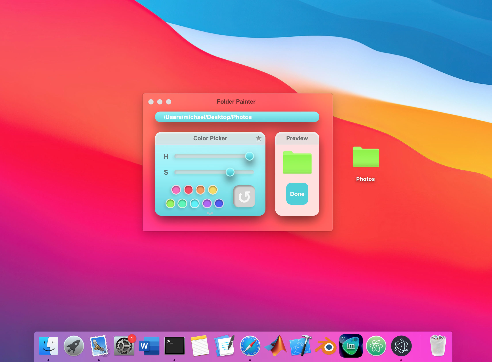
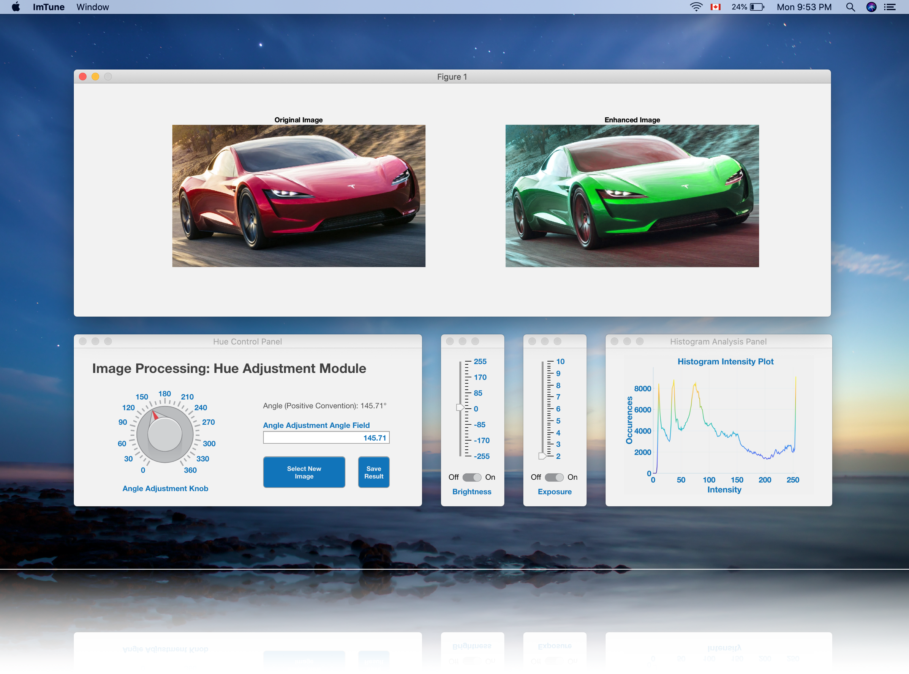
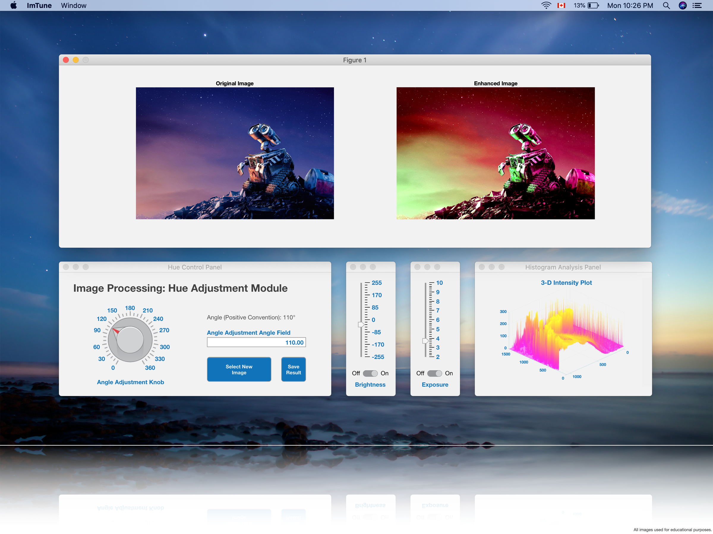
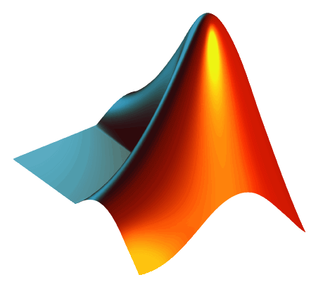

 
 
 

<b>Portfolio by Michael Troeung</b>
 
Electrical Engineering Graduate

 
 

   
<b>GPA Grapher </b>

 

A desktop application for graphing the cumulative and term GPAs (Grade Point Averages) of students. The project was completed using JavaScript and HTML/CSS. Uses the NodeJS and ElectronJS frameworks to combine front-end and back-end code. Save data handled using JSON files. MacOS and Windows compatible.

 

|Scrollable and Draggable Elements (gif) |Dynamic Graphing (gif)|
|---|---|
|||

### Features
- Graphing CGPA (Cumulative Grade Point Averages) and Term GPA (Grade Point Averages)
- Pie chart mark distribution
- All graphing is dynamic as user edits/adds courses
- Image capture and export to desktop as PNG
- Adaptable to allow mark upload if academic institutions wish to implement application
 

### Languages/Frameworks
&nbsp;&nbsp;&nbsp;&nbsp;&nbsp;&nbsp;&nbsp;&nbsp;&nbsp;&nbsp;&nbsp;&nbsp;&nbsp;&nbsp;&nbsp;&nbsp;&nbsp;&nbsp;&nbsp;&nbsp;&nbsp;&nbsp;

All animations implemented using CSS. Profile icon supports drag-and-drop functionality. Chart.js powers the graphical portions of the application. NodeJS modules used for file handling and profile icon retrieval. 

 

### Project Files 
[GPA Grapher Source Files](https://github.com/MichaelTr7/Michael-Troeung-Portfolio/tree/master/GPA%20Grapher)&nbsp;&nbsp;&nbsp;&nbsp;&nbsp;&nbsp;&nbsp;&nbsp;&nbsp;&nbsp; [MacOS Build [dmg]](https://drive.google.com/drive/folders/1HKVSya3CwY_vwsjX5w_pc1payJniDMHA?usp=sharing)&nbsp;&nbsp;&nbsp;&nbsp;&nbsp;&nbsp;&nbsp;&nbsp;&nbsp;&nbsp; [Windows Build [exe]](https://drive.google.com/drive/folders/1zcelsNSHBWuEIjWm4K8EeRCr6eBVwG7k?usp=sharing)

MacOS [.dmg] and Windows [.exe] installers available above. <b> NOTE: On MacOS right click and open to override warning. </b>

 
 
 

   
<b>IconConverter </b>

 

A desktop widget for converting PNG images into MacOS and Windows application icons. The core resizing and conversion methods were implemented using shell scripts while the front-end was built using HTML/CSS. The animations and keyframes were controlled with only JavaScript and CSS animations standard to the language. 

 

|Drag and Drop Files (gif) |File Type Detection (gif)|
|---|---|
|||

### Features
- Converts PNG images into .icns and .ico icon formats
- Icons generated include a series of resolutions that support a variety of sizes used through each Operating System (OS)
- Exports all files directly onto the desktop
 

### Languages/Frameworks
&nbsp;&nbsp;&nbsp;&nbsp;&nbsp;&nbsp;&nbsp;&nbsp;&nbsp;&nbsp;&nbsp;&nbsp;&nbsp;&nbsp;&nbsp;&nbsp;&nbsp;&nbsp;&nbsp;&nbsp;&nbsp;&nbsp;&nbsp;&nbsp;&nbsp;

Resizing images and conversion from PNG to .incs and .ico takes advantage of the speed of shell scripts. NodeJS' child process module was used to connect the interface with the shell scripts. The curves of the User-Interface (UI) was implemented by writing SVG line paths in the HTML code opposed loading SVG images which allows for future flexibility. Windows .ico conversion uses png-to-ico module.

 

### Project Files 
[IconConverter Source Files](https://github.com/MichaelTr7/Michael-Troeung-Portfolio/tree/master/IconConverter%20MacOS)&nbsp;&nbsp;&nbsp;&nbsp;&nbsp;&nbsp;&nbsp;&nbsp;&nbsp;&nbsp; [MacOS Build [dmg]](https://drive.google.com/drive/folders/16CnL6BPPoXdi-hbTKbkRuKbJGT2Dc7y5?usp=sharing)&nbsp;&nbsp;&nbsp;&nbsp;&nbsp;&nbsp;&nbsp;&nbsp;&nbsp;&nbsp;

MacOS [.dmg] installer available above. <b> NOTE: On MacOS right click and open to override warning. </b>

 
 
 

   
  <b>Folder Painter </b>

 

A desktop widget/application that can change the colour of any folder on MacOS. The project was completed using Bash, Python, JavaScript and HTML/CSS. Uses the NodeJS and ElectronJS frameworks to combine front-end and back-end code. Inspired by the coloured tags used throughout the apple ecosystem.

 

|Folder Path Detection (gif) |Favourite Colours Panel (gif)|
|---|---|
|||

### Features
- Folder detection through full path name
- Favourites colour palette that can be docked and undocked
- Hue and saturation adjustments
- Supports dragging and dropping of folders
 

### Languages/Frameworks
&nbsp;&nbsp;&nbsp;&nbsp;&nbsp;&nbsp;&nbsp;&nbsp;&nbsp;&nbsp;&nbsp;&nbsp;&nbsp;&nbsp;&nbsp;&nbsp;&nbsp;&nbsp;&nbsp;&nbsp;&nbsp;&nbsp;&nbsp;

Python and OpenCV used for image processing the folder colour. Javascript and NodeJS used to pop() last field in path name for folder detection. Simple CSS animations and keyframes used to create paint and button transitions. Icon switching implemented using Bash/Shell scripts. 

 

### Project Files 
[Folder Painter Source Files](https://github.com/MichaelTr7/Michael-Troeung-Portfolio/tree/master/Folder%20Painter)

 
 
 

   
<b>Simple Connect4 </b>

 

A minimalist Connect4 game used to practice working with arrays of arrays/pseudo 2D-arrays. The project focusses on solely using modern web-technologies including JavaScript and HTML/CSS. Implementing cursor tracking and interactivity was a main learning goal of this project.

 

|Main Interface|Winner Validation Algorithm (gif)|
|---|---|
|||

### Features
- Interactive counters/tokens
- 2-player mode and winner validation
- Original drop sound effect created in Garageband
 

### Languages/Frameworks
&nbsp;&nbsp;&nbsp;&nbsp;&nbsp;&nbsp;&nbsp;&nbsp;&nbsp;&nbsp;&nbsp;&nbsp;&nbsp;&nbsp;&nbsp;&nbsp;&nbsp;&nbsp;

All animations implemented using CSS variables and keyframes. Sound effects loaded as mp3 audio files and triggered by click event listeners. Arrays or arrays used to record the grid of tokens dropped.

 

### Project Files 
[Simple Connect4 Source Files](https://github.com/MichaelTr7/Michael-Troeung-Portfolio/tree/master/Simple%20Connect4)&nbsp;&nbsp;&nbsp;&nbsp;&nbsp;&nbsp;&nbsp;&nbsp;&nbsp;&nbsp; [MacOS Build [dmg]](https://drive.google.com/drive/folders/1lfDyGsYl_j4C993BLizrCVzV11KzKXua?usp=sharing)&nbsp;&nbsp;&nbsp;&nbsp;&nbsp;&nbsp;&nbsp;&nbsp;&nbsp;&nbsp;[Online Pages Demo](https://michaeltr7.github.io/Simple-Connect4/)

 
 
 

   
  <b>Audio Dock</b>

 

A desktop widget/application for visualizing audio actively playing. Built using JavaScript and HTML/CSS. This project was created in response to the spectrum analyzer being phased out of all newer versions of iTunes/Apple Music. Created to blend seamlessly into the OS and accompany the iTunes/Apple Music miniplayer.

 

|Dynamic Style Menu|Frost White Style (gif)|
|---|---|
|||

### Features
• Five visualization styles  
• Easily scalable to allow more styles to be added  
• Functions: ⌘ + S (style menu) and ⌘ + H (hide visualizer)

 

### Languages/Frameworks
&nbsp;&nbsp;&nbsp;&nbsp;&nbsp;&nbsp;&nbsp;&nbsp;&nbsp;&nbsp;&nbsp;&nbsp;&nbsp;&nbsp;&nbsp;&nbsp;&nbsp;&nbsp; &nbsp;&nbsp;&nbsp;&nbsp;&nbsp;   

Javascript and the p5.js library used to calculate the Fast Fourier Transform (FFT). Canvas drawing uses a combination of standard HTML/CSS and p5.js functions. ElectronJS was used to create the transparent windows used throughout the visualizer and style menu. Uses ElectronJS getPrimaryDisplay() functions to scale application to various display sizes.

 

### Project Files 
[Audio Dock Source Files](https://github.com/MichaelTr7/Michael-Troeung-Portfolio/tree/master/Audio%20Dock)&nbsp;&nbsp;&nbsp;&nbsp;&nbsp;&nbsp;&nbsp;&nbsp;&nbsp;&nbsp; [MacOS Build [zip]](https://drive.google.com/drive/folders/1Z-g9GOXuyJG1UygZ2Er74UJ8IfL5ECuD?usp=sharing)

MacOS [.dmg] and Windows [.exe] installers in progress, zipped builds available above. <b> Right click and open to override warning. </b>

 
 
 

   
  <b>ImTune (Image Processing Application)</b>

 
  
 
A desktop application inspired by the drive to further implement image processing principles learned during undergraduate studies. Compiled standalone application using MATLAB. Coded programmatically and can edit any picture selected by retrieving the image through its path. Uses UI elements including uifigure, uiknob, uibutton, etc. 

 
 

  

 

  

### Features
- Hue adjustment using HSI (Hue, Saturation, Intensity) colour space rotation
- Brightness and exposure adjustments
- Intensity plots and histograms in 2-D and 3-D simultaneously
- Image selection and saving from anywhere on device’s file system
 

### Languages/Technologies

 &nbsp;&nbsp;&nbsp; 

Built using MATLAB and GUI developed programatically. Application icon designed using Vectonator Pro and post processed in ImTune itself.

 

### Project Files 
[ImTune Source Files](https://github.com/MichaelTr7/Michael-Troeung-Portfolio/tree/master/ImTune)&nbsp;&nbsp;&nbsp;&nbsp;&nbsp;&nbsp;&nbsp;&nbsp;&nbsp;&nbsp; [MacOS Build [zip]](https://drive.google.com/drive/folders/10Wm7Y13gPYRx8QjkQi8mBrokyo62O_TN?usp=sharing)

MacOS [.dmg] and Windows [.exe] installers in progress, zipped builds available above. <b> Right click and open to override warning. </b>

### Contact Information
Reach out to me at one of the following places!

- LinkedIn at <a href="https://www.linkedin.com/in/michaeltroeung/" target="_blank">`LinkedIn/michaeltroeung.com`</a>
- Stackoverflow at <a href="https://stackoverflow.com/users/13669087/michaeltr7" target="_blank">`Stackoverflow/michaeltroeung.com`</a>

